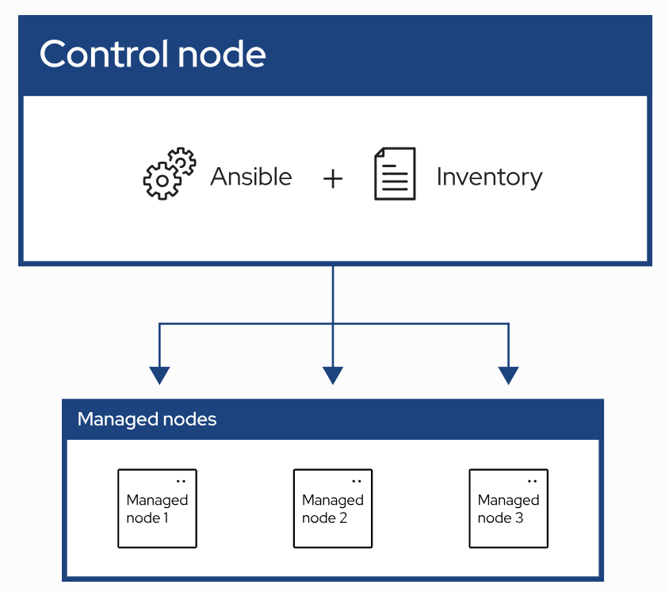

# Ansible

## Introduction

Ansible **automates the management of remote systes and control their desired state.**

As shown in the diagram above, most Ansible environments have **three main components**:

1) **`Control node`**

    - A system on which Ansible is installed
    - You run Ansible command such as `ansible` or `ansible-inventory` on a control node

2) **`Inventory`**

    - A list of managed nodes that are logically organized
    - You create an inventory on the control node to describe host deployments to Ansible

3) **`Managed node`**

    - A remote system, or host, that Ansible controls

### Common Use Cases of Ansible

- Eliminate repetition and simplify workflows
- Manage and maintain system configuration
- Continuously deploy complex software
- Perform zero-downtime rolling updates

### How Ansible is designed?

Ansible is designed around the following principles:

1) **Agent-less architecture**

    - Low maintenance overhead by avoiding the installation of additional software across IT infrastructure

2) **Simplicity**

    - Automation playbooks use straightforward YAML syntax for code that reads like documentation
    - Ansible is also decentralized, using SSH with existing OS credentials to access to remote machines

3) **Scalability and flexibility**

    - Easily and quickly scale the system you automate through a modular design that supports a large range of operating systems, cloud platforms, and network devices

4) **Idempotence and predictability**

    - When the system is in the state your playbook describes, Ansible does not change anything, even if the playbook runs multiple times

## Ansible Installtion

2 main methods:

- <a href="https://docs.ansible.com/projects/ansible/latest/installation_guide/intro_installation.html">Installing Ansible, mainly using `pip`</a>
- <a href="https://docs.ansible.com/projects/ansible/latest/installation_guide/installation_distros.html">Installing Ansible on specific operating systems</a>

## Appendix

- <a href="https://docs.ansible.com/projects/ansible/latest/index.html">Ansible Community Documentation</a>