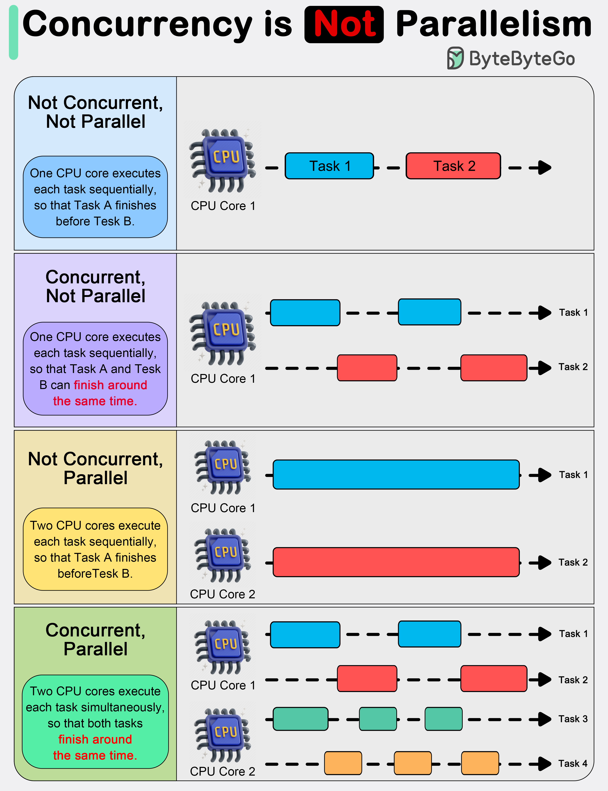
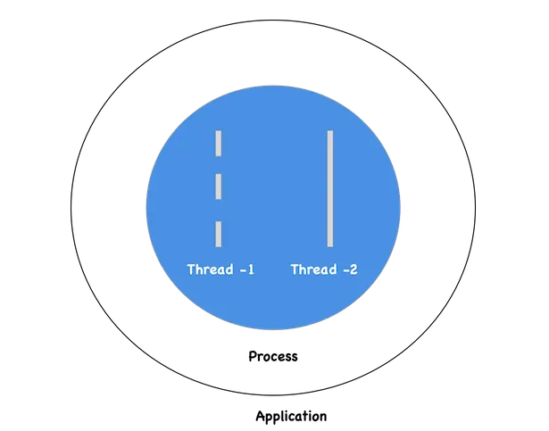

# Concurrency VS Parallelism

**Concurrency:**

-  Executing multiple tasks at the same time but not necessarily simultaneously
- In a `single core environment`, concurrency is achieved via a process called `context-switching`
- If its a `multi-core environment`, concurrency can be achieved through `parallelism`

**Parallelism:**

- Performing two or more tasks simultaneously
- Happens only in `multi-core environment`

## Concepts of Concurrency & Parallelism

 

In practical terms, `concurrency` enables a program to remain responsive to input, perform background tasks, and handle multiple operations in a seemingly simultaneous manner, even on a single-core processor. It’s particularly useful in `I/O-bound` and high-latency operations where programs need to wait for external events, such as file, network, or user interactions.

`Parallelism`, with its ability to perform multiple operations at the same time, is crucial in `CPU-bound` tasks where computational speed and throughput are the bottlenecks. Applications that require heavy mathematical computations, data analysis, image processing, and real-time processing can significantly benefit from parallel execution.

## Threads & Processes

**Threads:**

- Sequence of execution of code which can be executed independently of one another
- Smallest unit of tasks that can be executed by an OS
- A program can be single threaded or multi-threaded

**Process:**

- Instance of a running program
- A program can have multiple processes
    - A process usually starts with a single thread i.e a primary thread but later down the line of execution it can create multiple threads

**Distribution of Processes and Threads in an Application:**

## Synchronous & Asynchronous

**Synchronous:**

- Tasks are executed one after another
- Each task waits for any previous task to complete and then gets executed

**Asynchronous:**

- When one task gets executed, you could switch to a different task without waiting for the previous to get completed
- Asynchronous programming model helps us to achieve concurrency
- Asynchronous programming model in a multi-threaded environment is a way to achieve parallelism

## Appendix

Reference links:

- [Concurrency, Parallelism, Threads, Processes, Async, and Sync — Related?](https://medium.com/swift-india/concurrency-parallelism-threads-processes-async-and-sync-related-39fd951bc61d)
- [Difference between Concurrency and Parallelism](https://www.geeksforgeeks.org/operating-systems/difference-between-concurrency-and-parallelism/)
- [Concurrency vs Parallelism](https://bytebytego.com/guides/concurrency-is-not-parallelism/)