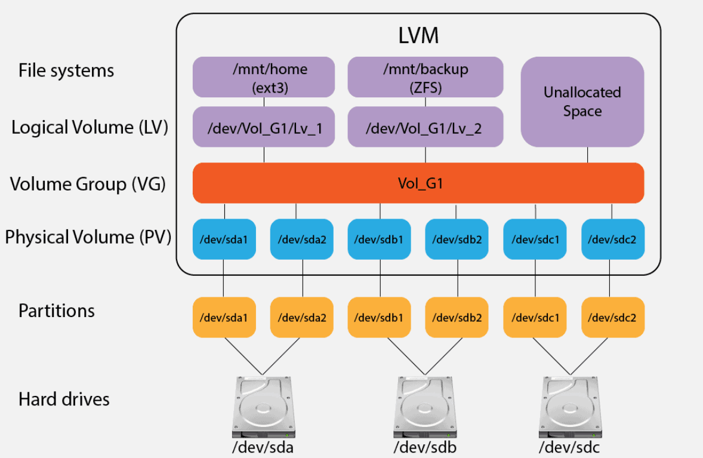

# Logical Volume Manager (LVM)

The logical volume manager **introduces `extra layers of abstraction` between the `disks or storage devices presented to a Linux system` and the `file systems placed on those disks or storage devices`**.

## Why to use LVM?

1) Flexible Capacity

    - You can create file systems that extend across multiple storage devices

    - You can aggregrate multiple storage devices into a single logical volume

2) Easily Resize Storage While Online (Mounted / Active)

    - Expand or shrink file systems in real-time while the data remains online and fully accessible

    - Without LVM, you would have to reformat and re-partition the underlying storage devices. You would need to take the file system offline to perform that work. With LVM, you eliminate that problem

3) Online Data Relocation

    - Easily migrate data from one storage device to another while online

4) Convenient Device Naming

    - You can use human-readable device names of your choosing

5) Disk Striping

    - With LVM, you can stripe data across two or more disks

    - Increase throughput by allowing your system to read data in parallel

6) Data Redundancy / Data Mirroring

    - Increase fault tolerance and reliability by mirroring your data to more than one copy of your data

    - Using LVM mirroring prevents single points of failure
    
        - If 1 storage device fails, your data can be accessed via another storage device
        - You can then fix or replace the failed storage device to restore your mirror all without downtime

7) Snapshots

    - Create point-in-time snapshots of your filesystems

    - This is perfect for you when you need consistent backups

        - E.g. you can pause, writes to a database, take a snapshot of the logical volume where that database data resides, then resume rights to that database

        - In this way, you ensure your data is in a known good state when you perform backup of that snapshot

## LVM: Layer of Abstraction



<br>

The Logical Volume Manager (LVM) in Linux uses **three layers of abstraction** to manage physical storage flexibly: 

1) `Physical Volumes (PV)`

    - First layer of abstraction
    - Storage devices used by LVM
    - These storage devices do not have to be physical, as long Linux sees it as a block storage device
    - You can allocate an entire storage device as a PV, or you can partition a storage device and use just that 1 partition as a PV

2) `Volume Groups (VG)`

    - Second layer of abstraction
    - Made up of one or more physical volumes (PV)
    - A pool of storage
    - If you want to increase the size of the pool, you can simply add more PVs
    - You can have different types of storage in the same volume group if you want

3) `Logical Volumes (LV)`

    - Third layer of abstraction
    - Created from a volume group (VG)
    - File systems are then created on top of those logical volumes (LV)
        - Without LVM, you would create a file system on a disk partition
        - With LVM, you create a file system on a logical volume (LV)
    - As long there's free space in volume gorup (VG), logical volumes can be extended
    - You can also shrink logical volumes to reclaim unused space if you want, but typically in practice, you will find yourself extending logical volumes

## Creating Physical Volumes (PV), Volume Groups (VG) and Logical Volumes (LV)

**Logical Volume Creation Process:**

1) Create one or more `physical volumes (PV)`
2) Create a `volume group (VG)` from those one or more physical volumes (PV)
3) Create one or more `logical volumes (LV)` from the volume group (VG)

### Create Physical Volumes (PV)

Before you can create a physical volume, you need to know what storage devices are available.

- `lvmdiskscan` : Check all storage devices that have the ability to be used with LVM
- `lvmdiskscan -l` : Scans only for existing physical volumes (PV)
- `pvs` : Reports summary info for initialized physical volumes (PV)
- `pvdisplay` : Verbose multi-line output for each physical volumes (PV)
- `pvscan` : Scan all supported LVM block devices in the system for physical volumes (PV)

Command to create `physical volume (PV)`:

```shell
pvcreate /<storage_device_path_or_partition_path_name> # For single PV

pvcreate /<storage_device_path_or_partition_path_name_1> ... /<storage_device_path_or_partition_path_name_N> # For multiple PVs
```

### Create Volume Groups (VG)

Command to create `volume groups (VG)`:

```shell
vgcreate <Volume_Group_Name> /<Physical_Volume_Path> # With single PV

vgcreate <Volume_Group_Name> /<Physical_Volume_Path_1> ... /<Physical_Volume_Path_N> # With multiple PVs
```

Run `vgs` to view one-line-per-VG summary

Run `vgdisplay` to view multi-line output of VG summary

### Create Logical Volumes (LV)

Command to create `logical volumes (LV)`:

```shell
lvcreate -L <device_size> -n <Logical_Volume_Name> <Volume_Group_Name>

# NOTE:
# <device_size> is to be written in human readable format, e.g. key in `100G` for 100GB
```

Run `lvs` to view one-line-per-LV summary

Run `lvdisplay` to view multi-line output of LV summary
- Main difference compared to `lvs` is that it has **LV Path**, where the file system format is as below:

    ```
    /dev/<Volume_Group_Name>/<Logical_Volume_Name>
    ```

Once logical volume is created, we can put a file system on our logical volume and mount that file system.

```
mkfs -t <file_system_type> /dev/<Volume_Group_Name>/<Logical_Volume_Name>
```

Of course, later we can create mountpoint for it

```
mount /dev/<Volume_Group_Name>/<Logical_Volume_Name> /<mount_point_path>
```

Besides this, you can also edit [/etc/fstab](./06_Disk_Management.md#etcfstab--the-file-system-table) if need special settings after booting up as well.

### Extents in LVM

In Linux LVM, an extent is the **fundamental, fixed-size unit of space allocation**. All disk space within a volume group (VG) is divided into these uniform chunks.

There are 2 main types of extents:

1) **Physical Extents (PE)**

    - These are the chunks of space on the underlying physical volumes (PV)

2) **Logical Extents (VE)**

    - These are the chunks of space within a logical volume (LV). The LVM maps logical extents to physical extents

Commands to check for LE and PE:

- `pvdisplay` [add option `-m` include mapping details] : Includes PE size and total/free PE count
- `vgdisplay` [add option `-m` include mapping details] : Includes PE size, total PEs, allocated PEs and free PEs
- `lvdisplay` [add option `-m` include mapping details] : Includes number of LEs they use
- `pvs`, `vgs`, `lvs`

We can use `lvextend`, `lvreduce` or `lvresize` commands to specify the size and number of extents by using `-l` option.

Below example shows with `lvextend` command:

```shell
# Method 1: Mentioning extents number
lvextend -l <number_of_extents> /dev/<Volume_Group_Name>/<Logical_Volume_Name>

# Method 2: Mentioning percentage of extents
lvextend -l 100%FREE /dev/<Volume_Group_Name>/<Logical_Volume_Name> # Use 100% of remaining free extents
```

## Extending Volume Groups (VG) and Logical Volumes (LV)

**NOTE:** If volume group (VG) has no free space, you will need extend the volume group (VG) before you can extend your logical volume (LV) within the volume group (VG).

Before extend your volume group (VG) [assuming no free space for VG], you will need to do as below:

```shell
# Step 1: Add new PV
pvcreate /<storage_device_path_or_partition_path_name>

# Step 2: Add the PV to extend the VG
vgextend <Volume_Group_Name> /<Physical_Volume_Path> # NOTE: /<Physical_Volume_Path> == /<storage_device_path_or_partition_path_name>
```

Command to extend logical volumes (LV):

```shell
lvextend -L +<device_size> -r /dev/<Volume_Group_Name>/<Logical_Volume_Name>

# `+` sign to place as the sample command above. Easier, because only need to tell how many extra device size to add on

# If no `+` sign is given in front of <device_size>, you need to specify the exact end resulting size. Not prefer to do this

# NOTE:
# <device_size> is to be written in human readable format, e.g. key in `100G` for 100GB

# EXTRAS:
# `-r` option is crucial, because it will not only update the size of LV in LVM, but also update the size in the filesystem

# If in case `-r` option is not given, it will only resize the LV in LVM, but not the filesystem mounted to LV
# To fix this, you will need to run the below command:
resize2fs /dev/<Volume_Group_Name>/<Logical_Volume_Name>
```

## Mirroring Logical Volumes (LV)

Let's assume you have created another volume group (VG), you can create a mirrored logical volume.

Command to create mirrored logical volume:

```shell
lvcreate -m <number_of_mirror> -L <device_size> -n <Mirrored_Logical_Volume_Name> <Volume_Group_Name>

# Then you can run `lvs` to check on column `Cpy%Sync` to see how many percent are sync after mirroring

# The mirrored LV block device name will be /dev/<Volume_Group_Name>/<Mirrored_Logical_Volume_Name>
```

## Removing Logical Volumes (LV), Physical Volumes (PV) and Volume Groups (VG)

Steps to remove LV, PV and VG as a whole:

1) Unmount the file system mounted to logical volume (LV)

    ```shell
    umount /<mount_file_path>
    ```

2) Remove underlying logical volume (LV)

    ```shell
    lvremove /dev/<Volume_Group_Name>/<Logical_Volume_Name>
    ```

3) Remove Volume Group (VG) after all its LVs are removed

    ```shell
    vgremove <Volume_Group_Name>
    ```

4) Remove Physical Volumes (PV)

    ```shell
    pvremove /<Physical_Volume_Path>
    ```

    Optionally, you can do this (safer) if VG not removed as below:

    ```shell
    vgreduce <Volume_Group_Name> /<Physical_Volume_Path>

    # This method reduce VG size while removing PV
    # This is a safer way to do compared to `pvremove`
    ```

## Migrating Data from One Storage Device to Another

Command to move data from 1 PV to another PV:

```shell
pvmove /<Src_Physical_Volume_Path> /<Dest_Physical_Volume_Path>

# For /<Src_Physical_Volume_Path>, you can do as below to detach it since data already migrated to another PV, and also because its allocated PE will be zero:
vgreduce <Src_Volume_Group_Name> /Src_Physical_Volume_Path>
pvremove /Src_Physical_Volume_Path>
```