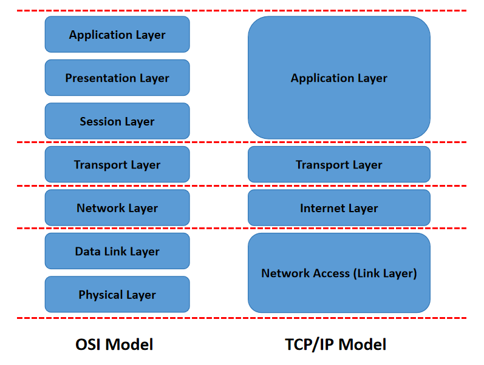
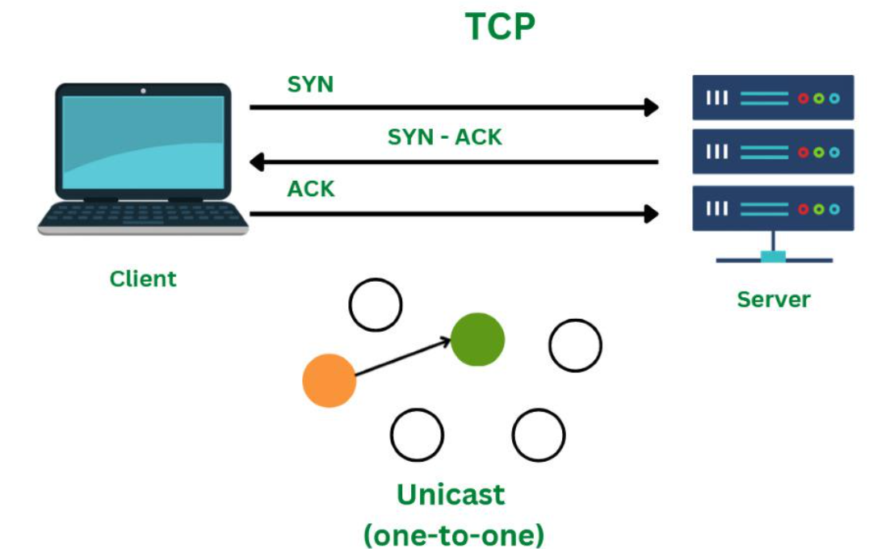
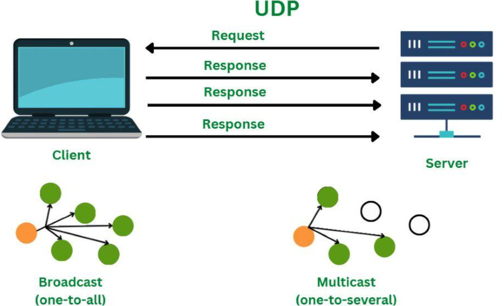
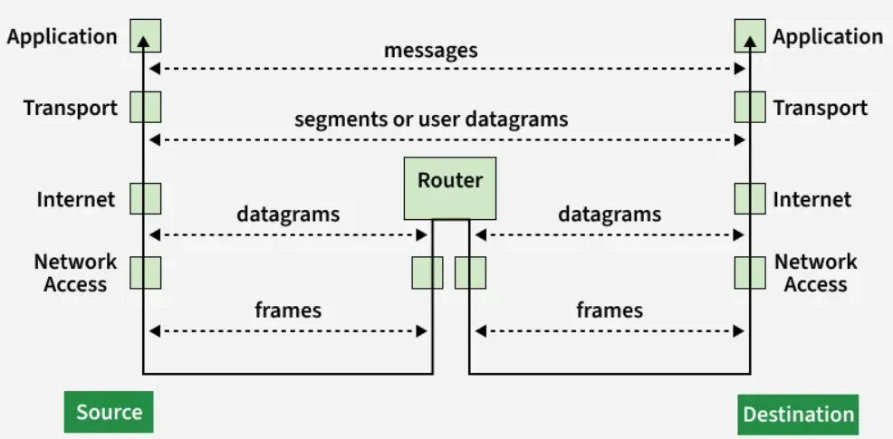

# Computer Networking

Computer networking is the practice of **connecting two or more computing devices to share data and resources**, using physical cables or wireless connections and a set of rules called communication protocols.

## Basic Terminologies of Computer Networking

1) `Network` : A group of connected computers and devices that can communicate and share data

2) `Node` : Any device that can send, receive or forward data in a network
    - E.g. Laptops, mobiles, printers, earbuds, servers, etc

3) `Networking Devices` : Devices that manage and support networking functions
    - E.g. Routers, switches, hubs, access points

4) `Host` : Network-connected device that runs applications, acts as a source or destination for data, and has a complete network stack (server or client)

    - `Server` : A host that offers services, data, or resources
    - `Client` : A host that requests services or resources from a server

5) `Transmission Media` : The physical or wireless medium through which data travels between devices

    - `Wired media` : Ethernet cables, optical fibre
    - `Wireless media` : Wi-Fi, Bluetooth, infrared

6) `Service Provider Networks` : Networks offered by external providers that allow users or organizations to lease network access and capabilities. 
    - E.g. internet providers, mobile carriers, etc

7) `Firewall` : A security tool (hardware or software) that monitors network traffic. 
    - Based on set rules, it either allows, blocks or drops data

## OSI Model (Open Systems Interconnection Model)

OSI model is a **conceptual framework created by the `ISO (International Organization of Standardization)`**, that **standardizes network communication** by dividing it into 7 distinct layers, each with specific functions.

### 7 layers of OSI Model

 

Each layer handles a specific function in the communication process, working from the bottom up (or top down) to ensure data gets from a sender to a receiver

| Layer Name | Layer Number | Function |
|:---:|:---:|---|
| `Physical Layer` | 1 | Deals with the physical transmission of data, like cables, connectors and electrical signals |
| `Data Link Layer` | 2 | Manages data transfer between two directly connected nodes, handling error detection and control |
| `Network Layer` | 3 | Responsible for logical addressing, routing data packets across different networks |
| `Transport Layer` | 4 | Manages end-to-end data delivery, ensuring reliability and flow control between applications |
| `Session Layer` | 5 | Establishes, maintains, and terminates communication sessions between applications |
| `Presentation Layer` | 6 | Translates, encrypts, and compresses data to ensure it's in a format the application can understand |
| `Application Layer` | 7 | Provides network services directly to the user applications, such as email and file transfers |

 

The basic elements of a layered model are:

1) Services

    - Sets of actions that a layer offers to another (higher) layer

2) Protocols

    - Sets of rules that a layer uses to exchange information

3) Interfaces

    - Communication between the layers

### Detailed Diagram of OSI Model Layers

 

- `Host layers` (Top 4 layers) are **concerned with data itself** and how it is **processed and presented to end users**

- `Media layers` (Bottom 3 layers) focus on **actual physical transmission** and **trasnfer data across the network**

- Protocols Used in the OSI Model layers:

    | OSI Model Layer | Protocol Data Unit | Protocols |
    |:---:|:---:|---|
    | `Physical Layer` | Bits | USB, SONET/SDH, etc |
    | `Data Link Layer` | Frames | Ethernet, PPP, etc |
    | `Network Layer` | Packets | IP, ICMP, IGMP, OSPF, etc |
    | `Transport Layer` | Segments (for TCP)   or   Datagrams (for UDP) | TCP, UDP, SCTP, etc |
    | `Session Layer` | Data | NetBIOS, RPC, PPTP, etc |
    | `Presentation Layer` | Data | TLS/SSL, MIME, etc |
    | `Application Layer` | Data | FTP, SMTP, DNS, DHCP, etc |

### Data Flow in OSI Model (between sender & receiver)

## TCP/IP Model

TCP/IP model is a layered networking framework that explains how data is communicated between devices over a ntwork using standardized protocols to ensure reliable and efficient transmission.

- TCP = Transmission Control Protocol
- IP = Internet Protocol

TCP/IP is defined as a **four-layer architecture** consisting of `Application`, `Transport`, `Internet` and `Network Access` layers.

- Standardized by RFC 1122, which specifies its structure and behaviour
- Simpler and more practical than the [seven-layer OSI model](#osi-model-open-systems-interconnection-model)
- Serves as the core framework of the modern Internet and networking systems

### Illustration of Relationship between OSI and TCP/IP Models

 

### 4 Layers of TCP/IP Model

1) `Application Layer`

    - **Top layer of the TCP/IP model**, closest to the user, where applications like web browsers, email clients, and file-sharing tools interact with the network
    - Provides an **interface between user software and the lower network layers** that handle data transmission, enabling seamless communication over the network
    - Supports protocols such as HTTP, FTP, SMTP, and DNS
    - Handles data formatting so information is correctly understood by both sender and receiver
    - Provides encryption for secure communication
    - Manages sessions to track ongoing connections

2) `Transport Layer`

    - Ensures reliable and efficient delivery of data between devices, managing segmentation, ordering and retransmission as needed
        - **Segmentation and Reassembly** : Breaks large messages into packets and reassembles them at the destination
        - **Reliable Delivery & Error Handling** : TCP checks for errors, resends lost data, and ensures correct order
        - **Fast Communication** : UDP provides low-latency, connectionless delivery without error checking
        - **Flow Control** : Prevents the receiver from being overwhelmed by regulating data flow
        - **Multiplexing** : Uses port numbers to allow multiple applications to share the network simultaneously
    
    - **TCP** and **UDP** are two main transport layer protocols
        
        a) `TCP (Transmission Control Protocol)`:

        

        b) `UDP (User Datagram Protocol)`:

        
    
    - For more details, may refer to this [link](https://www.geeksforgeeks.org/computer-networks/transport-layer-protocols/)

3) `Internet Layer`

    - Responsible for addressing, packaging, and routing data packets so they can travel across networks and reach the correct destination device

    - Ensure that data can move between different networks efficiently
        - **Logical Addressing** : Assigns IP addresses to identify source and destination devices
        - **Packet Routing** : Determines the best path for data to travel across networks
        - **Fragmentation and Reassembly** : Breaks large packets into smaller ones for transmission and reassembles them at the destination
        - **Protocol Support** : Primarily uses IP (Internet Protocol), along with supporting protocols like ICMP for error reporting and ARP for address resolution

4) `Network Access (Link Layer)`

    - Responsible for **physically transmitting data over network hardware**, including cables, switches and wireless connections

    - Handles how data is formatted for the network medium and ensures it reaches the next device on the path
        - **Physical Transmission** : Sends and receives raw bits over physical media like Ethernet cables, fiber optics, or Wi-Fi
        - **Framing** : Organizes data into frames for proper transmissio and recognition by devices
        - **Error Detection** : Detects transmission errors using checksums or CRC
        - **MAC Addressing** : Uses hardware addresses to identify devices within the same network segment
        - **Access Control** : Determines how multiple devices share the same physical medium, avoiding collisions

### How TCP/IP Model Works?

 

## Appendix

Reference link:

- <a href="https://www.geeksforgeeks.org/computer-networks/open-systems-interconnection-model-osi/">What is OSI Model? - Layers of OSI Model</a>
- <a href="https://www.geeksforgeeks.org/computer-networks/tcp-ip-model/">TCP/IP Model</a>