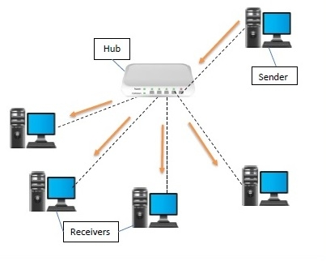
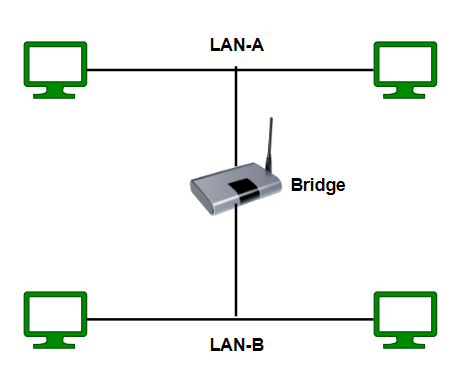
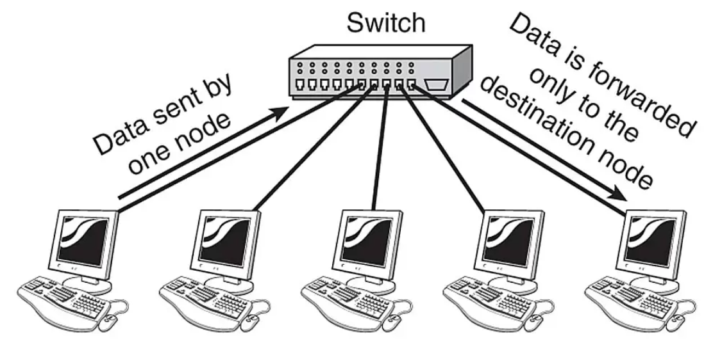

# Networking Devices

Networking devices are hardware or software elements that **make it possible for  data to move within and across networks**. 

- They enable routing, filtering, transmission, and security of data
- These devices can be physical (like routers or switches) or virtual (like cloud-based firewalls and software-defined routers)
- Every IT setup, whether in homes, enterprises, or data centers, depends on a mix of these devices to ensure smooth communication

## Types of Networking Devices

### Repeater

Repeater is responsible for **amplifying and rebroadcasting incoming signals to extend their reach and make them more usable**.

- Increase the network's reach, restore damaged or weak signals, and provide access to nodes that are otherwise inaccessible
- Operate by magnifying the received signal to a higher frequency domain, making it more scalable, accessible, and suitable for transmission

Repeater operates at the **Physical Layer (Layer 1)** of OSI model.

- Extend and boost network signals
- Operates on bits (0s and 1s)
- Cannot filter traffic and does not understand frames

### Hub

Hub connects multiple computer networking devices together, creating a single network segment.

- Has multiple input/output ports, where a **signal introduced at any port is echoed to every other port except the original incoming port**
- Works by **amplifying and retransmitting incoming signals**
- Operating at the **Physical Layer (Layer 1)**
- Some hubs may includes additional connectors such as BNC or AUI, allowing connection to legacy 10BASE2 or 10BASE5 network segments

However, hubs are **now largely obselete**, having been replaced by network switches in most cases, except in older or specialized installations.

### Bridge

Bridge **connects two or more network segments and filters the traffic between them**

- Isolate local segment traffic
- Reduce traffic congestion for better network performance

### Switch

Switch is a hardware device that connects multiple devices in a LAN (Local Area Network) and **uses MAC addresses to forward data frames to the appropriate destination**.

- Operates by **inspecting incoming frames and deciding where to forward them**, thus reducing unnecessary network traffic
- Considered as the smarter version of [hub](#hub)

**Basic Functions of a Switch:**

- **Frame Switching:** Forwarding data based on MAC addresses
- **MAC Address Learning:** Automatically building a MAC address table to map devices to switch ports
- **Loop Prevention:** Using protocol like Spanning Tree Protocol (STP) to avoid network loops
- **Full-Duplex Communication:** Allowing simultaneous data transmission and reception

**Types of Switch:**

1) `Unmanaged Switch`:

    - **Plug-and-play device with no configuration options**
    - Typically used in small networks or home environments
    - Key features:
        - Simple to use with no management interface
        - Limited or no security features
        - Fixed configuration with no VLAN (Virtual Local Area Network) support
        - Operates only in **Layer 2 (Data Link Layer)**

2) `Managed Switch`:

    - **Provides advanced features for network configuration, management and monitoring**
    - Used in enterprise networks where network control, performance optimization and secuirty are critical
    - Key features:
        - Supports VLANs (Virtual Local Area Networks)
        - Allows Quality of Service (QoS) settings
        - Provides SNMP (Simple Network Management Protocol) for remote monitoring
        - Enables configuration of port speed, duplex mode and security settings
        - Can operate at **Layer 2 and Layer 3** (routing)

3) `Smart Switch (Web-Managed Switch)`:

    - **Middle ground between unmanaged and managed switches**
    - Provide some management features through a web interface, making them easier to configure than fully managed switch
    - Suitable for small to medium-sized business networks that require some level of network management
    - Key features:
        - Basic VLAN and QoS support
        - Limited SNMP support
        - Web-based GUI for configuration
        - Less expensive than fully managed switch

4) `Layer 2 Switch`:

    - Operates at **Data Link Layer (Layer 2)** of OSI model and **uses MAC addresses to forward data frames**
    - Ideal for basic network segmentation in LANs
    - Key features:
        - MAC address learning and forwarding
        - Supports VLAN segmentation
        - No routing capability

5) `Layer 3 Switch (Multilayer Switch)`:

    - **Combines the functionality of a switch and a router**
    - Operates at both **Data Link Layer (Layer 2) and Network Layer (Layer 3)**, **enabling routing between VLANs**
    - Used in large enterprise networks where routing between multiple VLANs is necessary for efficiency
    - Key features:
        - Performs IP routing between VLANs
        - Supports advanced routing protocols like OSPF (Open Shortest Path First) and RIP (Routing Information Protocol)
        - Offers high performance for inter-VLAN traffic

6) `PoE Switch (Power over Ethernet)`:

    - Provide electrical power to network devices (such as IP cameras, VoIP phones and wireless access points) over Ethernet cables along with data
    - Ideal for deploying devices in locations where power outlets are scarce
    - Key features:
        - Simplifies deployment of devices without needing separate power supplies
        - PoE standards includes IEEE 802.3af (PoE), IEEE 802.3at (PoE+) and IEEE 802.3bt (PoE++)

### Router

### Brouter

### Modem

### Gateaway

### Load Balancer

### Firewall

### NIC card

## Appendix

Reference links:

- [Common Types of Network Devices and Their Functions](https://netwrix.com/en/resources/blog/network-devices-explained/)
- [Types of Switches in Computer Network](https://www.geeksforgeeks.org/computer-networks/types-of-switches-in-computer-network/)