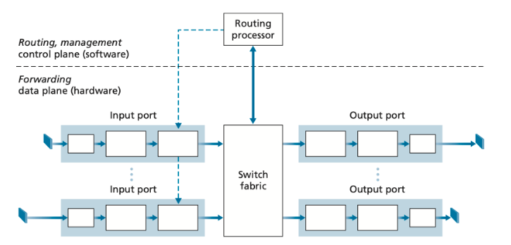
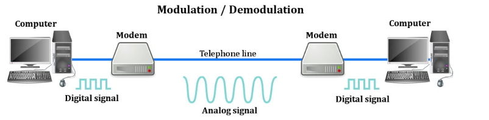

# Networking Devices

Networking devices are hardware or software elements that **make it possible for  data to move within and across networks**. 

- They enable routing, filtering, transmission, and security of data
- These devices can be physical (like routers or switches) or virtual (like cloud-based firewalls and software-defined routers)
- Every IT setup, whether in homes, enterprises, or data centers, depends on a mix of these devices to ensure smooth communication

## Types of Networking Devices

### Repeater

Repeater is responsible for **amplifying and rebroadcasting incoming signals to extend their reach and make them more usable**.

- Increase the network's reach, restore damaged or weak signals, and provide access to nodes that are otherwise inaccessible
- Operate by magnifying the received signal to a higher frequency domain, making it more scalable, accessible, and suitable for transmission

Repeater operates at the **Physical Layer (Layer 1)** of OSI model.

- Extend and boost network signals
- Operates on bits (0s and 1s)
- Cannot filter traffic and does not understand frames

### Hub

Hub connects multiple computer networking devices together, creating a single network segment.

- Has multiple input/output ports, where a **signal introduced at any port is echoed to every other port except the original incoming port**
- Works by **amplifying and retransmitting incoming signals**
- Operating at the **Physical Layer (Layer 1)**
- Some hubs may includes additional connectors such as BNC or AUI, allowing connection to legacy 10BASE2 or 10BASE5 network segments

However, hubs are **now largely obselete**, having been replaced by network switches in most cases, except in older or specialized installations.

### Bridge

Bridge **connects two or more network segments and filters the traffic between them**

- Isolate local segment traffic
- Reduce traffic congestion for better network performance
- Filter and segment traffic based on MAC addresses
- Operates at **Data Link Layer (Layer 2)**

### Switch

Switch is a hardware device that connects multiple devices in a LAN (Local Area Network) and **uses MAC addresses to forward data frames to the appropriate destination**.

- Operates by **inspecting incoming frames and deciding where to forward them**, thus reducing unnecessary network traffic
- Considered as the smarter version of [hub](#hub)

**Basic Functions of a Switch:**

- **Frame Switching:** Forwarding data based on MAC addresses
- **MAC Address Learning:** Automatically building a MAC address table to map devices to switch ports
- **Loop Prevention:** Using protocol like Spanning Tree Protocol (STP) to avoid network loops
- **Full-Duplex Communication:** Allowing simultaneous data transmission and reception

**Types of Switch:**

1) `Unmanaged Switch`:

    - **Plug-and-play device with no configuration options**
    - Typically used in small networks or home environments
    - Key features:
        - Simple to use with no management interface
        - Limited or no security features
        - Fixed configuration with no VLAN (Virtual Local Area Network) support
        - Operates only in **Layer 2 (Data Link Layer)**

2) `Managed Switch`:

    - **Provides advanced features for network configuration, management and monitoring**
    - Used in enterprise networks where network control, performance optimization and secuirty are critical
    - Key features:
        - Supports VLANs (Virtual Local Area Networks)
        - Allows Quality of Service (QoS) settings
        - Provides SNMP (Simple Network Management Protocol) for remote monitoring
        - Enables configuration of port speed, duplex mode and security settings
        - Can operate at **Layer 2 and Layer 3** (routing)

3) `Smart Switch (Web-Managed Switch)`:

    - **Middle ground between unmanaged and managed switches**
    - Provide some management features through a web interface, making them easier to configure than fully managed switch
    - Suitable for small to medium-sized business networks that require some level of network management
    - Key features:
        - Basic VLAN and QoS support
        - Limited SNMP support
        - Web-based GUI for configuration
        - Less expensive than fully managed switch

4) `Layer 2 Switch`:

    - Operates at **Data Link Layer (Layer 2)** of OSI model and **uses MAC addresses to forward data frames**
    - Ideal for basic network segmentation in LANs
    - Key features:
        - MAC address learning and forwarding
        - Supports VLAN segmentation
        - No routing capability

5) `Layer 3 Switch (Multilayer Switch)`:

    - **Combines the functionality of a switch and a router**
    - Operates at both **Data Link Layer (Layer 2) and Network Layer (Layer 3)**, **enabling routing between VLANs**
    - Used in large enterprise networks where routing between multiple VLANs is necessary for efficiency
    - Key features:
        - Performs IP routing between VLANs
        - Supports advanced routing protocols like OSPF (Open Shortest Path First) and RIP (Routing Information Protocol)
        - Offers high performance for inter-VLAN traffic

6) `PoE Switch (Power over Ethernet)`:

    - Provide electrical power to network devices (such as IP cameras, VoIP phones and wireless access points) over Ethernet cables along with data
    - Ideal for deploying devices in locations where power outlets are scarce
    - Key features:
        - Simplifies deployment of devices without needing separate power supplies
        - PoE standards includes IEEE 802.3af (PoE), IEEE 802.3at (PoE+) and IEEE 802.3bt (PoE++)

### Router

A router is a networking device that **forwards data packets between different computer networks**.

- **Connects multiple packet-switched networks or subnetworks**
- Managing traffic by **directing packets to their intended IP addresses**
- Allows multiple devices to share an Internet connection efficiently

Router uses **routing tables** to determine which interface the packet wil be sent out.

- Routing table is a set of rules, often viewed in table format, that is used to determine where data packets traveling over an Internet Protocol (IP) network will be directed

    - Each packet contains information about its origin and destination
    - Routing table provides the device with instructions for sending the packet to the next hop on its route across the network
    - Each entry in the routing table consists of the following entries:
        - `Network ID` : The network ID or destination corresponding to the route
        - `Subnet Mask` : The mask that is used to match a destination IP address to the network ID
        - `Next Hop` : The IP address to which the packet is forwarded
        - `Outgoing Interface` : Outgoing interface the packet should go out to reach the destination network
        - `Metric` : A common use of metric is to indicate the minimum number of hops (routers crossed) to the network ID
    - Routing table entries can be used to store the following types of routes:
        - Directly Attached Network IDs
        - Remote Network IDs
        - Host Routes
        - Default Route
        - Destination
    - When a router receives a packet, it examines the destination IP address and looks up into its routing table to figure out which interface packet will be sent out

There are **3 ways to populate routing table**:

1) Directly connected networks are added automatically

2) Using `Static Routing`

    - **Non-adaptive routing** which doesn't change the routing table unless the **network administrator changes or modifies them manually**
    - Does not use complex routing algorithms and It provides higher or more security than dynamic routing
    - **Advantages of Static Routing:**
        - No CPU overhead on routers, where cheaper routers can be used
        - More secure only the administrator controls allowed routes
        - No bandwidth is consumed between routers
    - **Disadvantages of Static Routing:**
        - Manually adding routes in large networks is time-consuming
        - It requires detailed knowledge of the network topology
        - New administrators must learn all routes to configure them correctly

3) Using `Dynamic Routing`

    - **Adaptive routing, automatically updates the routing table whenever there is a change in the network topology**
    - Uses complex algorithms to calculate routes, but it is less secure compared to static routing
        - **Common Protocols for Dynamic Routing:**
            - `Interior Gateway Protocols (IGPs)` : Operate within an Autonomous System (AS) or organization
                - `OSPF (Open Shortest Path First)` : A widely used, open-standard link-state protocol that finds the best path based on cost
                - `EIGRP (Enhanced Interior Gateway Routing Protocol)` : A Cisco proprietary, advanced distance-vector protocol offering fast covergence
                - `RIP (Routing Information Protocol)` : A simple distance-vector protocol using hop counts
            - `Exterior Gateway Protocols (EGPs)` : Connect different Autonomous Systems
                - `BGP (Border Gteway Protocol)` : The primary protocol used for routing between networks on the Internet
    - When a change occurs, routers exchange messages and recalculate the routes to ensure updated routing information is shared across the network
    - **Advantages of Dynamic Routing:**
        - Easy to configure
        - More effective at selecting the best route to a destination remote network and also for discovering remote networks
    - **Disadvantages of Dynamic Routing:**
        - Consumes more bandwidth for communicating with other neighbours
        - Less secure than static routing

**Router Architecture:**

- A typical router consists of:
    - `Input Port` :
        - Accepts packets, decapsulates them, and determines forwarding paths
    - `Switching Fabric` :
        - The core of the router connecting input ports to output ports
        - Can be implemented via:
            - **Memory switching** : CPU copies packets to output ports
            - **Bus switching** : Single bus transfers packets to the correct port
            - **Interconnection networks** : Complex designs connecting multiple input/output ports
    - `Output Port` :
        - Transmits packets to outgoing links, managing queuing and link-layer functions
    - `Routing Processor` :
        - Executing routing protocols and algorithms, maintaining the forwarding table

**Applications of Routers:**

- Connect remote servers, networks, and devices globally
- Support wired and wireless communication, including high-speed data transfer
- Used by ISPs to transmit audio, video, image, and email efficiently
- Implement access control, enabling selective resource usage

**Security Challenges in Routers:**

- `Vulnerability Exploits` : Firmware flaws can be exploited by attackers; regular updates are necessary
- `DDoS Attacks` : Distributed Denial-of-Service attacks can overload routers
- `Default Admin Credentials` : Weak or unchanged credentials can allow unauthorized access

### Brouter

A brouter is a **networking device that functions both as a bridge and a router**.

- Can forward data between networks (serving as a bridge)
- Can also route data to individual systems within a network (serving as a router)

### Modem

Modem stands for `Modulator/Demodulator`.

Modem is a networking device that is used to **connect devices connected in the network to the Internet**.

The main function of the modem is to **convert the analog signals that come from telephone wire into a digital form**.

**Main points on modulation & demodulation processes:**

- Modulation:

    - Converts digital signals into analog signals of different frequencies and transmits them to a modem at the receiving location
    - These signals From the modem can be transmitted over telephone lines, cable systems, or other communication mediums

- Demodulation:

    - Convert incoming analog signals back into digital data
    - They are commonly used to facilitate internet access by customers of an Internet Service Provider (ISP)

**Types of Modems:**

- `DSL modem (Digital Subscriber Line)` : Uses telephone cables and is considered the slowest connection
- `Cable modem` : Transmits information over TV lines faster than DSL
- `Wireless modem` : Connects devices using Wi-Fi networks and relies on nearby Wi-Fi signals
- `Fiber modem (Optical Network Terminal)` : Uses fiber-optic cables to transmit data as light, offering the fastest speeds
- `Satellite modem` : Connects to internet via satellite dish, ideal for remote or rural locations
- `Cellular modem (4G/5G)` : Allows a device to connect to the internet using a cellular network instead of Wi-Fi or fixed-line connections
- `Dial-up Modem` : Uses traditional telephone lines to transfer analog signals; now mostly obsolete

### Gateway

### Wireless Access Point (WAP)

### Load Balancer

### Firewall

### NIC card

### Intrusion Detection & Preventing Systems (IDPS)

### Virtual Network

## Appendix

Reference links:

- [Common Types of Network Devices and Their Functions](https://netwrix.com/en/resources/blog/network-devices-explained/)
- [Types of Switches in Computer Network](https://www.geeksforgeeks.org/computer-networks/types-of-switches-in-computer-network/)
- [Router in Computer Networks](https://www.geeksforgeeks.org/computer-networks/introduction-of-a-router/)
- [Routing Tables in Computer Network](https://www.geeksforgeeks.org/computer-networks/routing-tables-in-computer-network/)